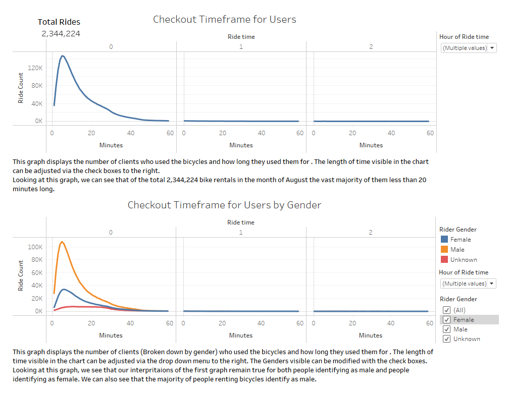

# Citibike Data Analysis
## Overview of Analysis

### In this analysis we will look at the metrics of a functioning bikesharing business in New York City to better understand how a similar business would function in Des Moines.

## Bikesharing Analysis Results

### In order to examine how the bikesharing business functions we will look at data from Citibke in New York City for the month of August.

## Summary

  Examining

