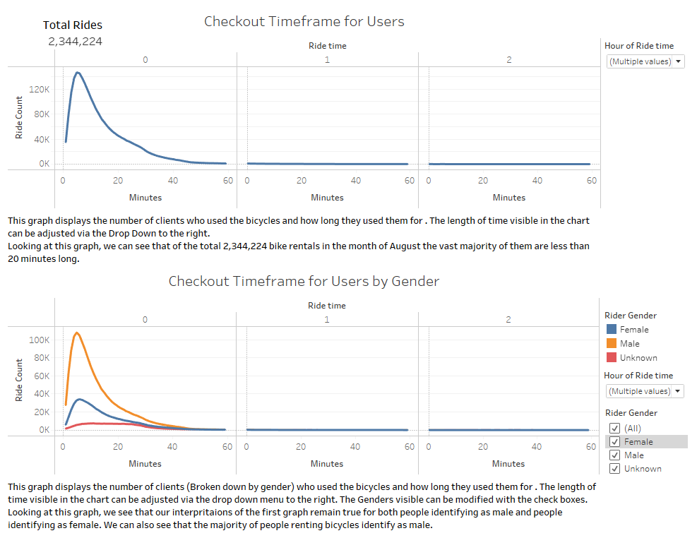
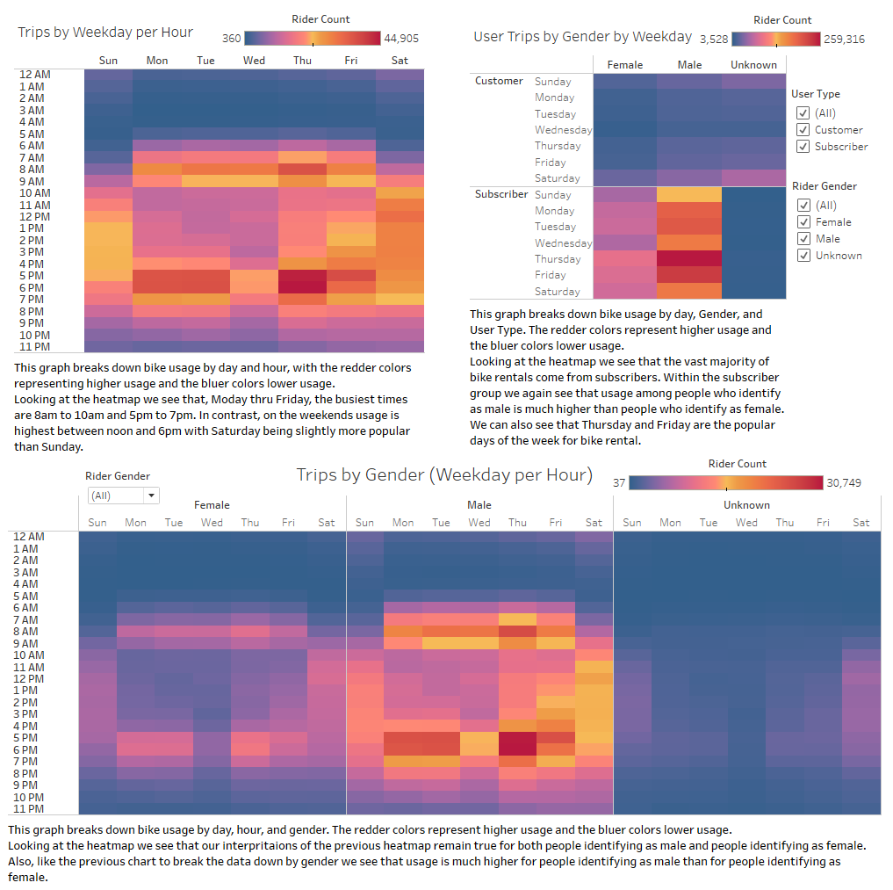
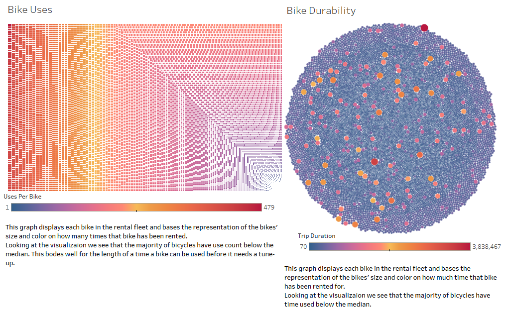

# Citibike Data Analysis
## Overview of Analysis

### In this analysis we will look at the metrics of a functioning bikesharing business in New York City to better understand how a similar business would function in Des Moines.

## Bikesharing Analysis Results

### In order to examine how the bikesharing business functions we will look at data from Citibke in New York City for the month of August.

## Summary

  In deciding the viability of a bikesharing business in Des Monines we examinied data from a similar business in New York City. In the frist two graphs above we saw that most rentals of the bikes are for short periods of time. This is good as this allows a single bike to be rented more times in a day. When we looked at the times of day usage was the highest we saw that it correlates with the times most people are either going to or coming home from work; It suggests a lot of the clients are using the bikes to commute to and from work. This is good because it is reliable repeat business. In the final two graphs we saw that based on use the Bikes should last a long time between needing repairs. That time could be extended even more if bikes were regularly rotated out of high use areas in low use areas. In addition to the visualizations in this analysis it would be helpful to see this data for an entire years worth of time. How does the fact that bikes won't be rented in the winter effect the business model, could something like snow tires be used to allow winter rental. Also this data is provided by bike ID, but seeing the data provided by user ID would help in seeing how long a person might maintain consistant use of the bike. Another visualization that might be helpful is looking at the daily or hourly usage by station. If people are commuting is one set of staions only popular in the morning and one only popular in the evening. Also helpful to have for determing wear on a bike would be distance traveled by bike ID. You can find the Tableau story with this data [here](https://public.tableau.com/app/profile/josh.decker/viz/bikesharing_16490222462780/BikeSharing?publish=yes)

